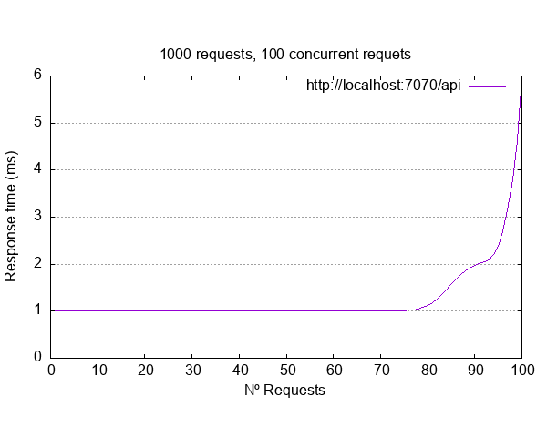

# node-vs-golang

In this project what is tried is to compare the effectiveness of a Node and Golagitng server with an overload test.

## Folder structure
    docker-compose.yml                 # Containers
        ├─── docs                      # Documentation
        ├─── api-golang                # API Rest with Golang
        ├─── api-node                  # API Rest with NodeJS
        ├─── docker-compose.yml        # Create containers
        └─── bench.sh                  # Script for launch test

## Requirements
- [Docker](https://docs.docker.com/get-docker/) y [Docker-Compose](https://docs.docker.com/compose/install/)
- [Bash 5.0](https://medium.com/@thechiefalone/how-to-install-bash-5-0-mac-os-ae570be6c687)
- [gnuplot](http://www.gnuplot.info/)

## Tests

The tests configured in the code are:

| Test      | Requests | Concurrents |
| :-------: | :------: | :-----:     |
| 0         | 100      | 1           |
| 1         | 1000     | 100         |
| 2         | 10000    | 1000        |  

To modify or add more tests, you must go to the file `bench.sh` 
and in the first lines they show the structure of the tests:

        # TEST 0
        declare -A test0=(
            [requests]=100
            [concurrent]=1
            [name]='test0'
        )

The field `name` is important because save de data under the name.

## Init

1. Clone the repository:
    
        git clone https://github.com/JaimeRC/node-vs-golang.git

2. Go to project folder:

        cd node-vs-golang
        
3. Init docker-compose:
   
        docker-compose up
        
        Starting apigolang ... done
        Starting apinode   ... done
        Attaching to apinode, apigolang
        apigolang     | 2020/10/21 13:44:14 Running on port 8080
        apinode       | 
        apinode       | > api-node@1.0.0 start /src
        apinode       | > node ./server/index.js
        apinode       | 
        apinode       | Server listening to  7070

    If you add the parameter `-d` it initializes in the background.
 
4. In another terminal, start the tests: 
    - Node Server:
   
            bash bench.sh node
            
            Benching: http://localhost:7070/api
   
    - Golang Server:

            bash bench.sh golang
            
            Benching: http://localhost:8080/api
            
5. After the tests, three files are created per server:
    - Description the tests in `output_node.txt` (only the first is shown):
    
            Benching: http://localhost:7070/api
            '1' concurrent user doing '100' page hits
            This shows you how well the web-server will handle a simple load of '1' user doing a number of page loads.
            
            This is ApacheBench, Version 2.3 <$Revision: 1843412 $>
            Copyright 1996 Adam Twiss, Zeus Technology Ltd, http://www.zeustech.net/
            Licensed to The Apache Software Foundation, http://www.apache.org/
            
            Benchmarking localhost (be patient).....done
            
            Server Software:        
            Server Hostname:        localhost
            Server Port:            7070
            
            Document Path:          /api/test
            Document Length:        Variable
            
            Concurrency Level:      1
            Time taken for tests:   0.143 seconds
            Complete requests:      100
            Failed requests:        0
            Non-2xx responses:      100
            Keep-Alive requests:    100
            Total transferred:      79900 bytes
            HTML transferred:       900 bytes
            Requests per second:    697.27 [#/sec] (mean)
            Time per request:       1.434 [ms] (mean)
            Time per request:       1.434 [ms] (mean, across all concurrent requests)
            Transfer rate:          544.06 [Kbytes/sec] received
            
            Connection Times (ms)
                          min  mean[+/-sd] median   max
            Connect:        0    0   0.0      0       0
            Processing:     1    1   0.6      1       6
            Waiting:        1    1   0.6      1       6
            Total:          1    1   0.6      1       6
            
            Percentage of the requests served within a certain time (ms)
              50%      1
              66%      1
              75%      1
              80%      1
              90%      2
              95%      2
              98%      4
              99%      6
             100%      6 (longest request)
            
            =============================================================================================================

    - Graph with the results per test in `node_test0.png` (only the first is shown):
    
        
